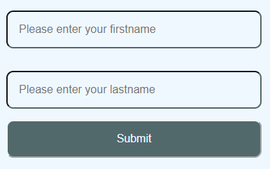

# Cypress

Cypress is a framework for building E2E tests for a website. First we need to install cypress, create
a `package.json` (or use existing project) and execute: 

```shell
npm install cypress --also=dev
```

This will add a cypress dependency to your package, we can also add an execution script:
```json
"scripts": {
  "e2e": "cypress open"
}
```
Now when we run `npm run e2e` cypress app will start and create `cypress` folder with default files inside.

## Structure

Let's have a look inside the `cypress` folder, you will find 4 folders inside and in your root path a `cypress.json`.

- fixture: Contains our reusable data in json format, you can access them in the e2e test.
- integration: folder for our e2e test (specs)
- plugin: plugin integration, can be used to insert custom behavior in different life cycles
- support: a lib for own commands, very useful for often used operations (f.e. login/open navigation) 
- cypress.json: contains configuration for cypress execution

## Test setup

In the public folder we have a dummy site with couple elements, which we want to test. We also have a
webserver installed, so we can access the site through `http://localhost:8000`. To start
the webservice, open command line in `frontend/cypress` and execute `nmp run webserver`. Now open `http://localhost:8000/public/index.html` 
in the browser to make sure everything works fine.

We also need to define a viewport for cypress execution, this can be done in [cypress.json](cypress.json)

```json
{
  "viewportWidth": 1920,
  "viewportHeight": 1080
}
```

Now we are ready for our first test.

## First test

Create an [index.spec.js](cypress/integration/index.spec.js) below `cypress/integration/` folder. The 
first element we want to test is a button, the site has two buttons, one will increase the counter,
the other decrease it. We will let cypress click on the buttons and check if the counter changes correctly.


```js
/// <reference types="cypress" />                         // used for better autocomplete

describe('dummy site', () => {                            // test name

  it('button - check on click behavior', () => {          // test execution name

    cy.visit('http://localhost:8000/public/index.html')   // open site an

    // Check initial value
    cy.get('.js-button-count').should('have.text','0')    // Check initial value

    // Check value increase
    cy.get('.js-button-counter-up').click()               // click on the 'increase' button
    cy.get('.js-button-count').should('have.text','1')    // check the change from 0 -> 1

    // Check value decrease
    cy.get('.js-button-counter-down').click()             // click on the 'decrease' button
    cy.get('.js-button-count').should('have.text','0')    // check the change from 1 -> 0
  })
})
```

To execute the test, open command line in `frontend/cypress` and execute `nmp run e2e` this will open
the cypress app, you will see


click on the `index.spec.js` a new browser window will open and the test will be executed, you will 
see the results left from the window.


## Form submit test

With the next test we want to check the data submission in a form. 



Add new test to the `index.spec.js`

```js
  it('input - check user data submit', () => {

    cy.visit('http://localhost:8000/public/index.html')

    // Select the form, the within makes all "get" functions search inside the form, 
    // so we don't need 'data-test-id' for each input
    cy.get('[data-test-id="form-submit-user-data"]').within(() => {   

      // Check placeholders
      cy.get('input[name="firstname"]')                               // Select the 'firstname' input and check placeholder
      .invoke('attr', 'placeholder')
      .should("eq","Please enter your firstname")

      cy.get('input[name="lastname"]')                                // Select the 'lastname' input and check placeholder
      .invoke('attr', 'placeholder')
      .should("eq","Please enter your lastname")

      // fill and submit the form
      cy.get('input[name="firstname"]').type("Max")                   // Fill 'firstname'
      cy.get('input[name="lastname"]').type("Mustermann")             // Fill 'lastname'

      cy.get('button').click()                                        // Submit form

      // Check success page
      cy.location('pathname').should('contain', '/submit.html')       // check if we are redirected to the successpage
    })
  })
```

## Additions

Are code is very basic and there is room for improvements. 

- all of our tests has to visit the site first, so we can move it in a `beforeEach` block
- we use static values which can be moved to the `fixtures` folder

Let's start with the `beforeEach` block. Remove the `cy.visit(...)` line from test execution and add
the following block.

```js
  beforeEach(() => {
    // Return to homepage before each execution
    cy.visit('http://localhost:8000/public/index.html')
  })
```

### Fixtures

To make sure we can adjust our tests easily it is common practice to use fixtures for all static 
values, so a change of a placeholder won't require changes in the code base, but only adjusting the fixture.
First we need to load fixtures, so we will create a `before` block and save the json in a global variable.

```js
  let data = undefined;

  before(() => {
    // Will load fixture/example.json in the data variable.
    cy.fixture('example').then(function (fixture) {
      data = fixture;
    })
  })
```

Now we can add the relevant data to the [example.json](cypress/fixtures/example.json).

```json
{
  "homepage": "http://localhost:8000/public/index.html",
  "submit_segment": "/submit.html",
  "firstname_placeholder": "Please enter your firstname",
  "firstname_value": "Max",
  "lastname_placeholder": "Please enter your lastname",
  "lastname_value": "Mustermann"
}
```

Now we have to replace the values in our [index.spec.js](cypress/integration/index.spec.js). The `beforeEach`
block will become:

```js
  beforeEach(() => {
    // Return to homepage before each execution
    cy.visit(data.homepage)
  })
```

