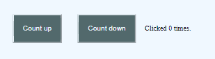
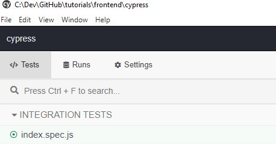
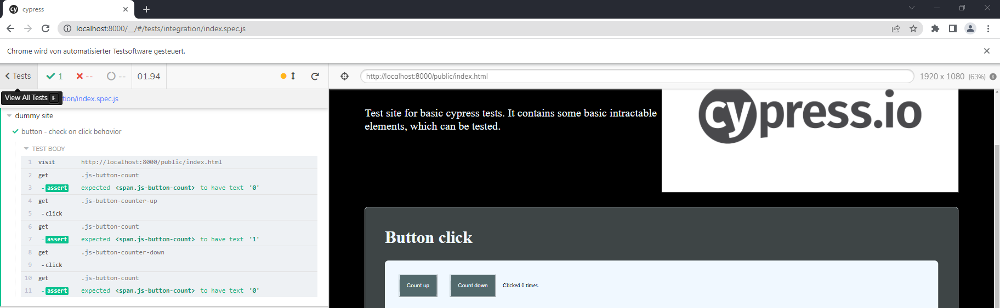

# Cypress

Cypress is a framework for building E2E tests for a website.

```shell
npm install cypress --also=dev
```
Add script 
```json
"scripts": {
  "e2e": "cypress open"
}
```
execute
```shell
npm run e2e
```

This will create  a cypress folder in your frontend application.

## Structure

- fixture: Contains our reusable data in json format, you can access them in the e2e test.
- integration: folder for our e2e test (specs)
- plugin: plugin integration, can be used to insert custom behavior in different life cycles
- support: a lib for own commands, very useful for often used operations (f.e. login/open navigation) 

## Test setup

In the public folder we have a dummy site with couple elements, which we want to test. We also have a
webserver installed, so we can access the site through `http://localhost:8000`. To start
the webservice, open command line in `frontend/cypress` and execute `nmp run webserver`. Now open `http://localhost:8000/public/index.html` 
in the browser to make sure everything works fine.

## First test

Create an [index.spec.js](cypress/integration/index.spec.js) below `cypress/integration/` folder. The 
first element we want to test are button clicks, the site has two buttons, one will increase the counter,
the other decrease it.



```js
/// <reference types="cypress" />                         // <-- used for better autocomplete

describe('dummy site', () => {                            // <-- test name

  it('button - check on click behavior', () => {          // <-- test execution name

    cy.visit('http://localhost:8000/public/index.html')   // <-- open site an

    // Check initial value
    cy.get('.js-button-count').should('have.text','0')    // Check initial value

    // Check value increase
    cy.get('.js-button-counter-up').click()               // click on the 'increase' button
    cy.get('.js-button-count').should('have.text','1')    // check the change from 0 -> 1

    // Check value decrease
    cy.get('.js-button-counter-down').click()             // click on the 'decrease' button
    cy.get('.js-button-count').should('have.text','0')    // check the change from 1 -> 0
  })
})
```

To execute the test, open command line in `frontend/cypress` and execute `nmp run e2e` this will open
the cypress app, you will see



click on the `index.spec.js` a new browser window will open and the test will be executed, you will 
see the results left from the window.


