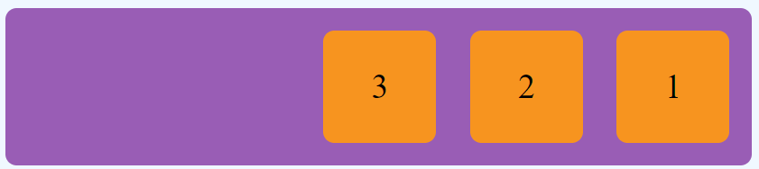

# Flexbox - Quick guide
[More in depth guide](https://css-tricks.com/snippets/css/a-guide-to-flexbox/)
## Basic row alignment
We start with the basic alignment of child elements from left to right.
```html
<!--Basic HTML-->
<div class="flex-container">
  <div class="flex-child">1</div>
  <div class="flex-child">2</div>
  <div class="flex-child">3</div>
</div>
```
```css
.flex-container {
  display: flex;
}
```
`display: flex` will order its direct child from left to right in one row.

With `flex-direction` we can override the default left to right direction
```html
<div class="flex-container flex-reverse">
  <div class="flex-child">1</div>
  <div class="flex-child">2</div>
  <div class="flex-child">3</div>
</div>
```
```css
.flex-reverse {
  flex-direction: row-reverse;
}
```

