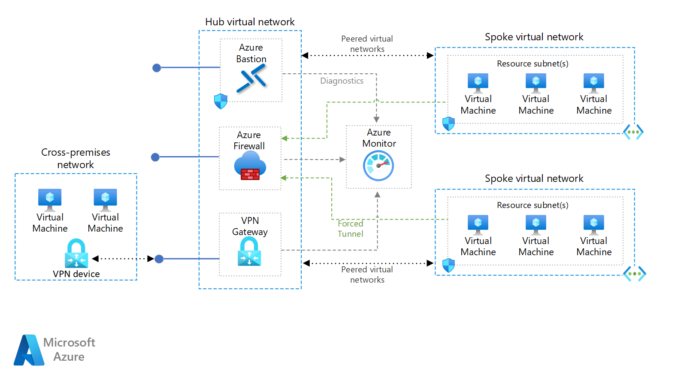

# Hub VNet

The Hub VNet is part of the Hub-spoke network topology in
Azure ([see here](https://learn.microsoft.com/en-us/azure/architecture/reference-architectures/containers/aks/baseline-aks))
. The Hub is the central point of connectivity and observability.

*The Infrastructure for AKS is slightly different from normal hub-spoke network, especially the role
of the Azure Firewall changes, as it is only responsible for outbound connections, but it still
illustrates better how monitoring is connected.

## Overview

The Hub VNet contains:

- [Azure Firewall](az_firewall.md) for outbound connections
- [Azure Bastion (optional)](az_bastion.md) used to access not to the internet exposed services
- [Gateway (optional)](gateway.md) used for VPN connections with other services outside the VNet.
- Monitoring

