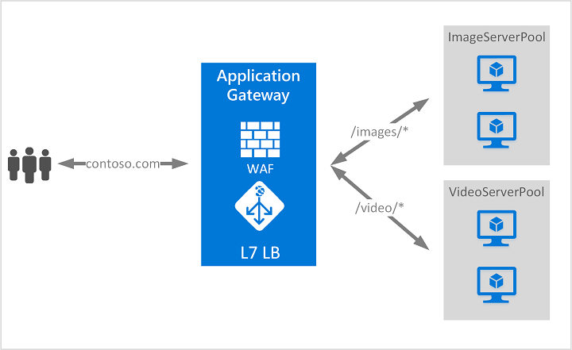

# Azure Application Gateway

Azure Application Gateway is a web traffic load balancer that enables you to manage traffic to your
web applications. Traditional load balancers operate at the transport layer (OSI layer 4 - TCP and
UDP) and route traffic based on source IP address and port, to a destination IP address and port.

For more information
see [here](https://learn.microsoft.com/en-us/azure/application-gateway/overview).
