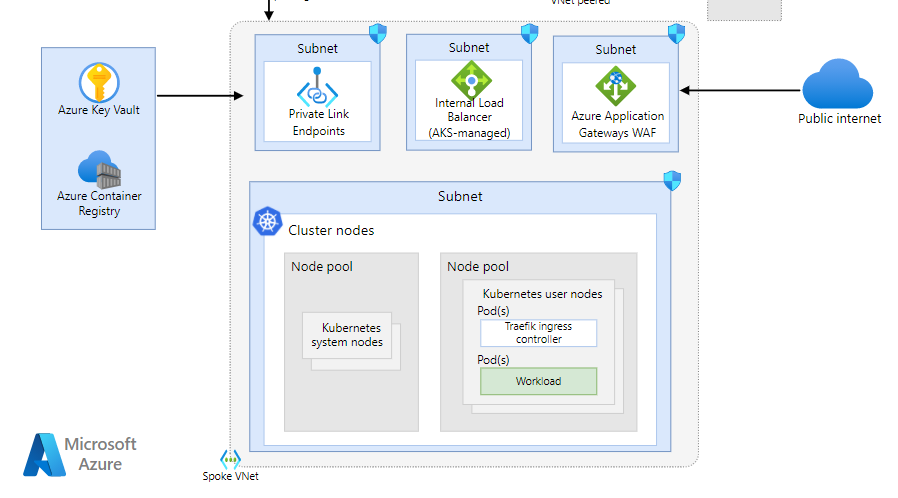

# Spoke VNet

The spoke virtual network contains the AKS cluster and other related resources.

## Overview

The spoke has four subnets:

- [Azure Application Gateways WAF](app_gateway.md) is a web traffic load balancer with integrated
  WAF the system from attacks
- [Internal Load Balancer](int_load_balancer.md) to route and distribute traffic
- [Private Link Endpoints](private_link.md) used to access private resources
- [Cluster Subnet](cluster.md) for the actual AKS implementation
