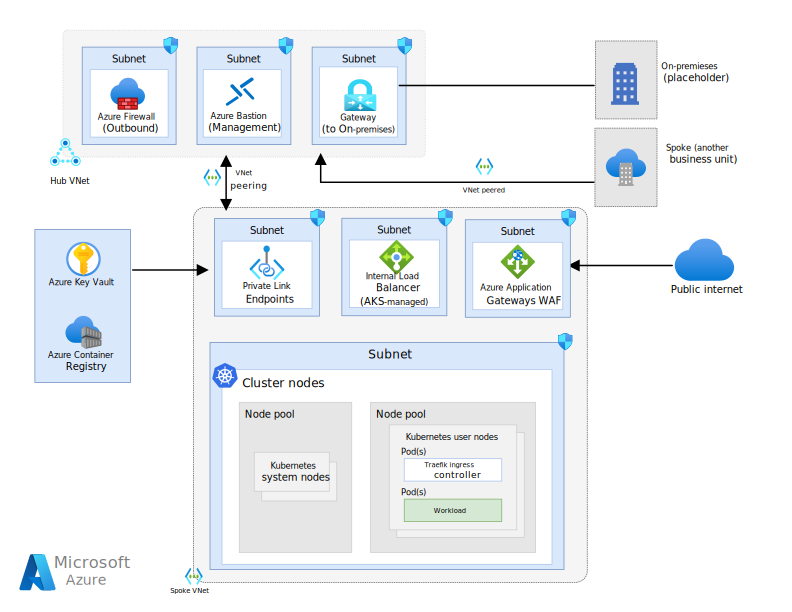

# Deep dive on Microsoft: Baseline architecture for an Azure Kubernetes Service (AKS) cluster

The Azure team provides a how to for setting up production ready AKS infrastructure. The Document
can be
found [here.](https://learn.microsoft.com/en-us/azure/architecture/reference-architectures/containers/aks/baseline-aks)
I want to dive in and try to understand their decisions and maybe learn something from it.

## Overview

The baseline consists of two mayor parts:

- [Hub VNet](Hub/readme.md) used as central point for connectivity and observability
- [Spoke VNet](Spoke/readme.md) used for the Kubernetes Deployment

## Pricing

Before we continue with planning we need to have a rough idea about the pricing of this
infrastructure. I will divide the costs by the VNets and then by subnet.

### Hub VNet

- Azure Bastion = 140$
- Azure Firewall = 950$
- VPN = 20$

Costs: 1200$

### Spoke VNet

- Azure Application Gateways WAF = 350$
- Internal Load Balancer = 25$
- Private Link Endpoints = 10$
- Cluster = 100$+

Costs: 500$

### Conclusion

As you can see this solution is very costly, most of the costs are used up by the azure security
features Firewall and Gateways. So if you are considering reducing the costs you will need to remove
one of the Fire Walls (there is also a Pricing Tier for Gateways without WAF).
