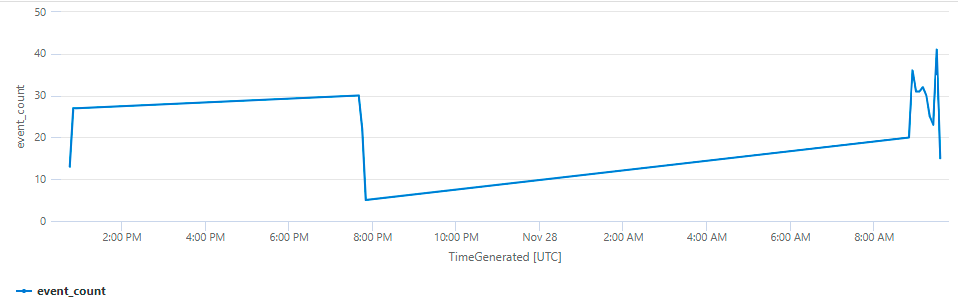
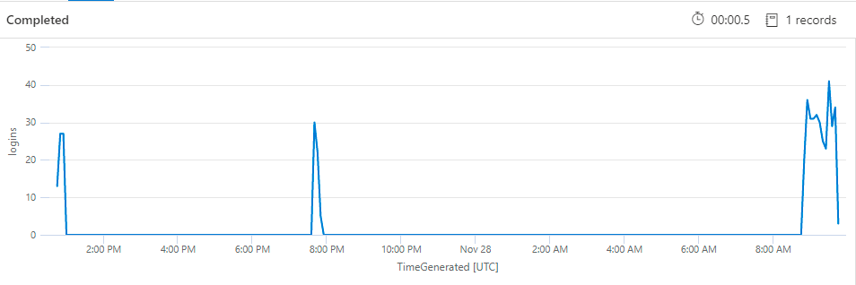
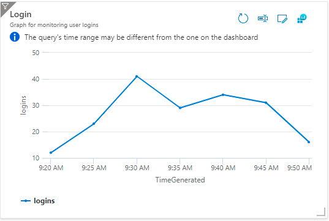

# Log Queries

[Azure Docs](https://docs.microsoft.com/en-us/azure/azure-monitor/logs/get-started-queries)

## Render Logs as graph

This query is useful for keep an eye on user interactions (f.e. login, downloads, purchases, ect)

```kusto
AppTraces 
| where Message == "Operation: customer login successful"
| summarize event_count = count() by bin(TimeGenerated, 5m)
| render timechart 
```



This query is fine but has a big downside, the missing values are skipped. This is a big Issue, if
you want to create alerts based on appearance of some massage.

Let's assume we have a sync process, and we want to make sure it is running, when sync is started it
generates a log entry:

```log
12/1/2021, 9:45:03.580 Sync: Sync started
```

The problem is the "Log search alert rule" does not consider missing log entries as an Issue, so you
can't define alerting as "Alert me, when the log is missing for 30 minutes". What we have to do is
populate dummy logs and give them a 0 while real logs will have the number 1, and then we sum those
numbers and if the count = 0 (meaning all log are generated by us) we can send an alert.

```kusto
AppTraces 
| where Message == "Sync started"
| summarize event_count = count() by bin(TimeGenerated, 5m)
| union (
          range x from 1 to 1 step 5
          | mv-expand TimeGenerated=range(now()-30m, now(), 5m) to typeof(datetime)
          | extend event_count=0
          )
| render timechart 
```

This generates the log:

| TimeGenerated             | event_count | description |
|:--------------------------|:------------|:------------|
| 12/1/2021, 9:42:03.580 AM | 0           | generated   |
| 12/1/2021, 9:38:03.580 AM | 0           | generated   |
| 12/1/2021, 9:35:03.580 AM | 3           | real        |
| 12/1/2021, 9:33:03.580 AM | 0           | generated   |
| 12/1/2021, 9:30:03.580 AM | 5           | real        |

The `union` is populating `TimeGenerated` for the last 30 minutes every 5 minutes
with `event_count=0` this will lead to some overlaps, but for the Alert this is not important, but
for graphs it is, so instead of union, we should use [make-series](https://docs.microsoft.com/en-us/azure/data-explorer/kusto/query/make-seriesoperator)
operator.

```kusto
AppTraces 
| where Message == "Operation: customer login successful"
| make-series logins = count() default=0 on TimeGenerated step 5m by Message
| render timechart 
```



One of the downsides of using `make-series` are false positives inside the Dashboards.



## Parse Log in fields

We have a log message, which contains of multiple relevant values, we can use the split mechanic:

```text
Price push for product '1223' (AUT) successful oldPrice='120' newPrice='130'
```

```kusto
AppTraces 
| where Message has "Price push for product" 
| parse Message with * "Price push for product '" ProductNumber:string "' (" Country ") " Status " oldPrice='"OldPrice"' newPrice='"NewPrice"'"crap
| project TimeGenerated, ProductNumber, Country, Status, OldPrice, NewPrice
```

This will generate the following log.

| TimeGenerated             | ProductNumber | Country | Status     | OldPrice | NewPrice |
|:--------------------------|:--------------|:--------|:-----------|:---------|:---------|
| 12/1/2021, 9:45:03.580 AM | 1223          | AUT     | successful | 120      | 130      |

