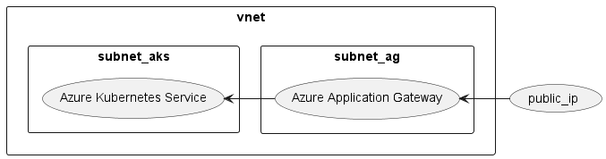

# Implementation of AKS with Azure Application Gateway

Azure Application Gateway is a web traffic load balancer. When combined with kubernetes Application
can be used as an ingress controller. For more detailed in formation on Application Gateway see
the [Microsoft Documentation](https://learn.microsoft.com/en-us/azure/application-gateway/overview).

To use Application Gateway(AG) as an entrypoint to our Kubernetes cluster we have a decision to
make. We can either use the AG just as an entry point and deploy the ingres controller (f.e.
traeffik or ngix) inside the kubernetes cluster, in this case, the AG will just rout all requests to
the internal ingres controller, or we can use the AG as the ingress controller.

The first case is straight forward, just set up the cluster as you normally would do and give the
ingress controller a static cluster IP, and define AG to rout everything to this IP. The second case
is slightly different and this is the one, we want to discuss. Although it looks like Microsoft is
more in favor of the first solution, at least this is what they define in
their [Baseline architecture for an Azure Kubernetes Service (AKS) cluster](../../baseline-aks/readme.md)
.

## Infrastructure



For our setup we will need:

- Application Gateway (AG)
- Azure Kubernetes Service (AKS)
- Vnet around AG & AKS
- two subnets for AG and AKS
- Public IP for the AG

### Namings

The best way to start a new terraform project, is to define alle relevant names. Most of the
companies, will have a naming module which can be either imported, or copied to the project. We
don't have this, so we need create it from scratch.

First we need the relevant variables for name generation:

```terraform
variable "environment_config" {
  description = "Configuration for environment"
  type        = object({
    project_name   = string
    env_short      = string
    location_short = string
    location_name  = string
  })
  default = {
    project_name   = "aks-ag-connection"
    env_short      = "dev"
    location_short = "weu"
    location_name  = "West Europe"
  }
}
```

For our usecase this is sufficient, but for real project, you will rather split this variable in 4
different and bundle them in the `locals.tf`.

Now we can generate our namings:

```terraform
locals {
  naming = {
    // Resource names
    rg_name       = "rg-${var.environment_config.env_short}-${var.environment_config.project_name}-${var.environment_config.location_short}"
    aks_name      = "aks-${var.environment_config.env_short}-${var.environment_config.project_name}-${var.environment_config.location_short}"
    aksnodes_name = "rg-${var.environment_config.env_short}-${var.environment_config.project_name}-${var.environment_config.location_short}-aksnodes"
    ag_name       = "ag-${var.environment_config.env_short}-${var.environment_config.project_name}-${var.environment_config.location_short}"
    dns_prefix    = "${var.environment_config.env_short}-${var.environment_config.project_name}-${var.environment_config.location_short}"

    // Network names
    vnet_name     = "vnet-${var.environment_config.env_short}-${var.environment_config.project_name}-${var.environment_config.location_short}"
    snet_aks_name = "snet-${var.environment_config.env_short}-aks-${var.environment_config.location_short}"
    snet_ag_name  = "snet-${var.environment_config.env_short}-ag-${var.environment_config.location_short}"
    ip_name       = "pip-${var.environment_config.env_short}-${var.environment_config.project_name}-${var.environment_config.location_short}"
  }
}
```

### Base setup

Now that we have all relevant names, we can create the `main.tf`, here we only have the ressource
group and provider config.

```terraform
provider "azurerm" {
  features {}
}

terraform {
  required_providers {
    azurerm = {
      source  = "hashicorp/azurerm"
      version = "~> 3.40.0"
    }
  }
}

resource "azurerm_resource_group" "this" {
  location = var.environment_config.location_name
  name     = local.naming.rg_name
}
```

### Network

Let's continue with setting up the network infrastructure in `network.tf`:

```terraform
resource "azurerm_virtual_network" "this" {
  name                = local.naming.vnet_name
  resource_group_name = azurerm_resource_group.this.name
  location            = azurerm_resource_group.this.location
  address_space       = ["192.168.0.0/16"]
}

resource "azurerm_subnet" "aks_snet" {
  name                 = local.naming.snet_aks_name
  resource_group_name  = azurerm_resource_group.this.name
  virtual_network_name = azurerm_virtual_network.this.name
  address_prefixes     = ["192.168.1.0/24"]
}

resource "azurerm_subnet" "ag_snet" {
  name                 = local.naming.snet_ag_name
  resource_group_name  = azurerm_resource_group.this.name
  virtual_network_name = azurerm_virtual_network.this.name
  address_prefixes     = ["192.168.2.0/24"]
}

resource "azurerm_public_ip" "ag_ip" {
  name                = local.naming.ip_name
  resource_group_name = azurerm_resource_group.this.name
  location            = azurerm_resource_group.this.location
  allocation_method   = "Static"
  sku                 = "Standard"
}
```

### Azure Application Gateway

Basically we only need to configure the tier and the frontend config for the AG, as the backend
config will be automatically populated by the ingress config inside the AKS, but because this is not
supported, we are forced to define at least one backend pool and one routing config. This makes the
whole config way more complicated, than it should have been.

```terraform
locals {
  backend_address_pool_name      = "${azurerm_virtual_network.this.name}-beap"
  frontend_port_name             = "${azurerm_virtual_network.this.name}-feport"
  frontend_ip_configuration_name = "${azurerm_virtual_network.this.name}-feip"
  http_setting_name              = "${azurerm_virtual_network.this.name}-be-htst"
  listener_name                  = "${azurerm_virtual_network.this.name}-httplstn"
  request_routing_rule_name      = "${azurerm_virtual_network.this.name}-rqrt"
  redirect_configuration_name    = "${azurerm_virtual_network.this.name}-rdrcfg"
}

resource "azurerm_application_gateway" "this" {
  name                = local.naming.ag_name
  resource_group_name = azurerm_resource_group.this.name
  location            = azurerm_resource_group.this.location

  sku {
    name     = "Standard_v2" // Only v2 are supporting function as ingress
    tier     = "Standard_v2"
    capacity = 2
  }

  gateway_ip_configuration {
    name      = "Gateway-IP-Config"
    subnet_id = azurerm_subnet.ag_snet.id
  }

  frontend_port {
    name = local.frontend_port_name
    port = 80
  }

  frontend_ip_configuration {
    name                 = local.frontend_ip_configuration_name
    public_ip_address_id = azurerm_public_ip.ag_ip.id
  }

  // The following block is just here as placeholder, the real data are populated by the ingress 
  // inside the AKS cluster 
  backend_address_pool {
    name = local.backend_address_pool_name
  }

  backend_http_settings {
    name                  = local.http_setting_name
    cookie_based_affinity = "Disabled"
    port                  = 80
    protocol              = "Http"
    request_timeout       = 60
  }

  http_listener {
    name                           = local.listener_name
    frontend_ip_configuration_name = local.frontend_ip_configuration_name
    frontend_port_name             = local.frontend_port_name
    protocol                       = "Http"
  }

  request_routing_rule {
    name                       = local.request_routing_rule_name
    rule_type                  = "Basic"
    http_listener_name         = local.listener_name
    backend_address_pool_name  = local.backend_address_pool_name
    backend_http_settings_name = local.http_setting_name
    priority                   = 1
  }

  lifecycle {
    // Very important, the config is populated by the internal ingress controller, so we need to
    // ignore all changes made by the ingress, the config here, is just a placeholder.
    ignore_changes = [
      tags, url_path_map, request_routing_rule, http_listener, probe, backend_http_settings,
      backend_address_pool
    ]
  }
}
```

As you can see only `sku`,`gateway_ip_configuration`,`frontend_port` and `frontend_ip_configuration`
are relevant, but of course if you don't want to use AG as ingress, you would define
in `backend_address_pool` the ip to your internal ingress and remove everything beside `tags`from
the `ignore_changes` block.

### Azure Kubernetes Service

The last piece missing is the AKS, we will place the nodes inside the `aks_snet` and connect it to
the AG.

```terraform
resource "azurerm_kubernetes_cluster" "this" {
  name                             = local.naming.aks_name
  location                         = azurerm_resource_group.this.location
  resource_group_name              = azurerm_resource_group.this.name
  node_resource_group              = local.naming.aksnodes_name
  http_application_routing_enabled = false
  dns_prefix                       = local.naming.dns_prefix

  default_node_pool {
    name           = "default"
    vm_size        = "Standard_B2s"
    node_count     = 1
    // We want to have the node is a specific snet
    vnet_subnet_id = azurerm_subnet.aks_snet.id
  }

  identity {
    type = "SystemAssigned"
  }

  network_profile {
    network_plugin     = "azure"
    dns_service_ip     = "10.0.0.10"
    docker_bridge_cidr = "172.17.0.1/16"
    service_cidr       = "10.0.0.0/16"
  }

  // Register Applicatione Gateway as a ingress controller
  ingress_application_gateway {
    gateway_id = azurerm_application_gateway.this.id
  }
}
```

### Ingress config

Finally, lets have a quick look on the ingres inside our kubernetes config:

```terraform
resource "kubernetes_ingress_v1" "region_ingress" {
  metadata {
    name        = "app-ingress"
    annotations = {
      "kubernetes.io/ingress.class" : "azure/application-gateway"
    }
  }

  spec {
    rule {
      http {
        path {
          backend {
            service {
              name = "my-app"
              port {
                number = 80
              }
            }
          }
          path = "/api/*"
        }
      }
    }
  }
}
```

As you can see, all you need it the right annotation, after deployment a new `backend_address_pool`
will be created, with the name `pool-default-my-app-80-bp-8080`. As you can see, the name consists
of the AKS node pool name, name of the service, port of the service and target port.

## Further steps

Now that we have everything in place it's time for some polishing. Currently, we have to use the IP
to access our cluster, so the first step should be to create a DNS entry for the IP. We also should
think about securing the SNETs and maybe create an egress config for the Apps inside our cluster.
Finally, we can think about enabling the WAF (Application Firewall) in the Application Gateway.

## Last remarks

This code was extracted from a much larger project and is used for illustration only. The extract
itself was never executed, or tested on the azure system. 


