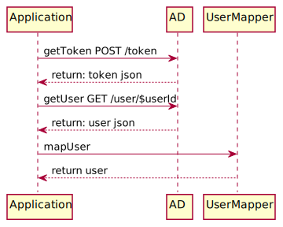

# Plant UML - IntelliJ
When I am creating `.md` files for my code, I often have difficulties to create diagrams. There are 
tons of good uml websites, plugins for confluence or even specific dedicated application for this task. 
Most of them have one major disadvantage you will to leave your application and use a tool for the creation, 
then make an image out of it and when possible export it as `.json` so when changes needed you can recreate it.
A good solution for this problem is [PlantUml](https://plantuml.com/) and it's integration to IntelliJ.
The best thing about PlantUML is also its worst thing, you are not drawing diagrams, you are coding them. 

## Setup
The setup ist pretty easy, install the PlantUML plugin from Marketplace, restart IntelliJ and you 
will have the option to create a new "PlantUML file".

## Sequence Diagram
My most common used diagram is the sequence diagram, a very deep introduction can be found on the [PlantUML Homepage](https://plantuml.com/de/sequence-diagram).
Let's start with the basic two-step flow.
- `Application` sends credentials to `AD` and requests an access token
- `AD` responses with JSON token
- `Application` uses the token to search for user with specific `$userId`


Now lets save the diagram as `.svg` image by clicking on the save icon in the navbar (on image yellow).


The diagram may not be a master piece, but it is sufficient for our purpose, let's add notes about 
the response json. This can be done with the `note` command, you also will have to define where note 
is shown `left` or `right`. For one line notes you can use `note left: My note` for multiline you 
can use it as block:

```puml
note left
First line
Second line
end note
```
With json notes our config would look like this.


We can also define the order of the actors. To get a better idea let's add an `UserMapper` to our diagram.


The default order would be:



Actor which comes later, will be added later, but we can define all actors beforehand then they will be added in the
order of definition:


We were to change the order, but the diagram is way messier that way and here we can see the disadvantages
of the PlantUML, we need to:
- add space
- change color scheme to black/white 
- make sure the text is on the right site of the line (I like text near the arrow head) 
- add activation to make everything a bit cleaner


Way better, there are tons of ways to customize your diagrams for more information I added the links below. 

# More
- [Using styles](https://plantuml.com/de/style-evolution)
- [Using skinparam](https://plantuml.com/de/skinparam)
